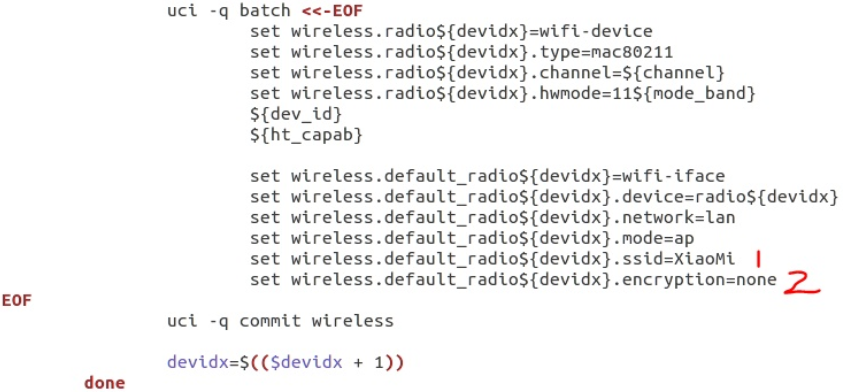
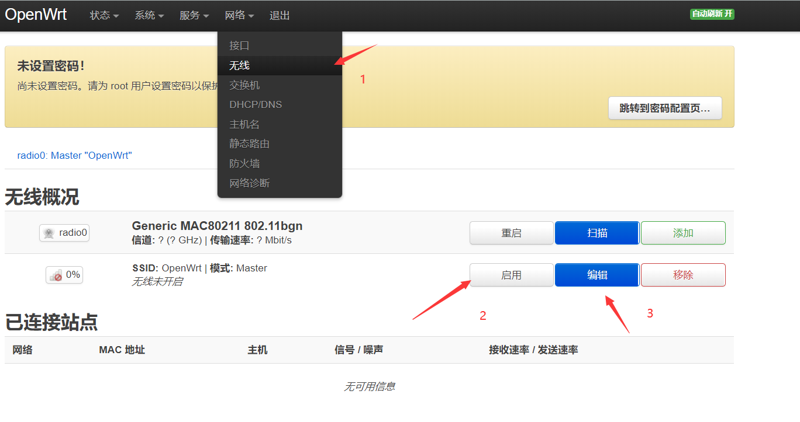
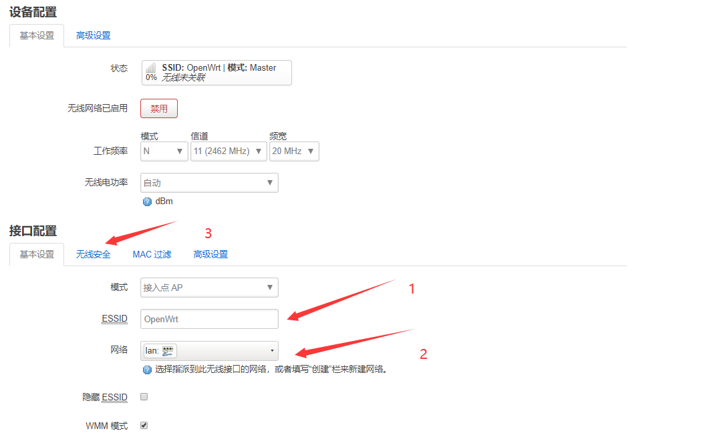

# 第一章 OpenWrt 虚拟机搭建
## 一、实验目的
熟悉基于 OpenWrt 的无线接入点（AP）配置
## 二、实验过程
### 1.源码中开启WIFI热点
要在源码中使能Wi-Fi信号，那么需要修改mac80211.sh这个脚本程序，位于openwrt源码 openwrt/package/kernel/mac80211/ files/lib/wifi目录。修改后的如下图所示：

将该文件中的 option disabled1 内容删除掉，上图为删除后的截图，上图中的标号1处为WIFI热点名称；标号二处为WIFI热点的密码，none代表不设置密码。
### 2.web界面中开启WIFI
如果没有在上一步骤源码中开启WIFI热点，将网线LAN口，进到Web控制界面，找到 网络---->无线  进入如下页面

如上图所示，点击上图中标号2的地方，如果修改WIFI的SSID和密码，可进入到图中标号3的编辑，进行信息的修改。
## 三、实验过程中出现的问题与解决
这一种情况比较少见，如果在Web控制页面中 没有启用WIFI的选项，如下图所示：

在这种情况下，点击上图中的添加按钮，进入后如下图：

可按照上图中的标号进行配置，其中标号3区域为WIFI密码配置，如果不进行配置，则默认WIFI热点为开放式
