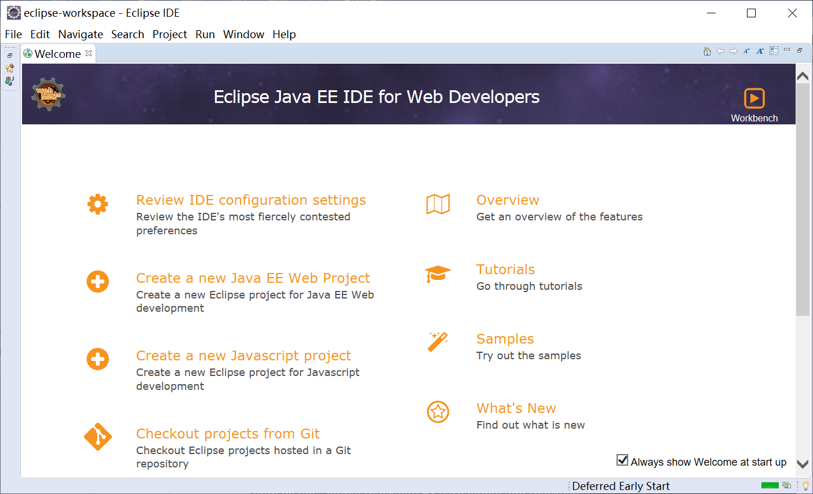

# chap0x05  第五章 Android 模拟器环境搭建笔记
## 一、安装和配置 Java SDK
### 1.安装JDK

### 2. 配置JAVA环境变量
#### 右键“此电脑”，选择“属性”->“高级”->“环境变量”，在系统环境变量里添加一个JAVA_HOME变量，输入JDK安装目录

#### 找到并双击编辑Path环境变量，弹出环境变量编辑框

#### 添加JDK的路径

#### 添加类路径环境变量，如下添加一个CLASSPATH

### 3. 测试JAVA安装
#### 打开CMD终端，输入命令：java -version，如果能看到JAVA版本信息就说明安装成功了

### 4. 安装SDK
#### 有两种方式，一种是exe安装程序，一种是压缩包，选择压缩包方式，下载解压即可。在解压后的目录双击SDK Manager

### 5. 设置SDK代理
#### SDK Manager中打开 Tools—>Manage Add-on Sites…—>User Defined Sites，添加如下地址：
#### http://mirrors.neusoft.edu.cn:80/android/repository/addon.xml

### 6. 配置SDK环境变量
#### 新建系统变量 ANDROID_HOME，输入SDK目录，在系统变量Path 中新增加两项：
#### %ANDROID_HOME%\tools
#### %ANDROID_HOME%\platform-tools

### 7. 测试SDK安装
#### 打开CMD控制台，输入 adb version，如果出现如下图所示信息，则安装成功

### 8. 安装Eclipse
#### Eclipse的下载安装非常简单，只要把压缩包下载下来，解压之后即可运行

## 二、安装和配置 Android 模拟器运行环境
### 前面我们已经配置好了java的开发环境，下载安装了Android SDK，并下载安装了Eclipse，接下来还需要安装一个Android开发使用的Eclipse插件，也就是Android Development Tools（ADT）
1.下载ADT

打开Eclipse，选择菜单中的“Help”，然后选择“Install New Software…”，在弹出的“Install”窗口中，单击“Add”按钮，并输入名称和选择下载的ADT插件压缩包，点击Add完成

然后一直Next，直到Finish完成，然后会提示你重启Eclipse，重启之后可能会要求你指定SDK安装位置

2.安装完成
安装完成之后，我们已经可以看到在Eclipse里边已经有Android开发的相关菜单和工具了

