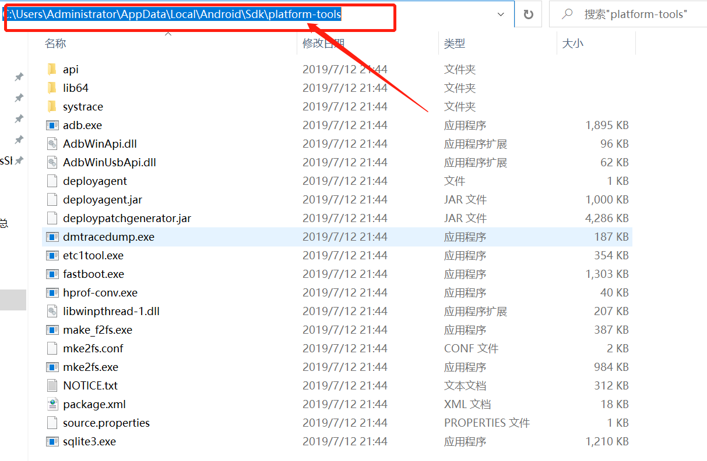
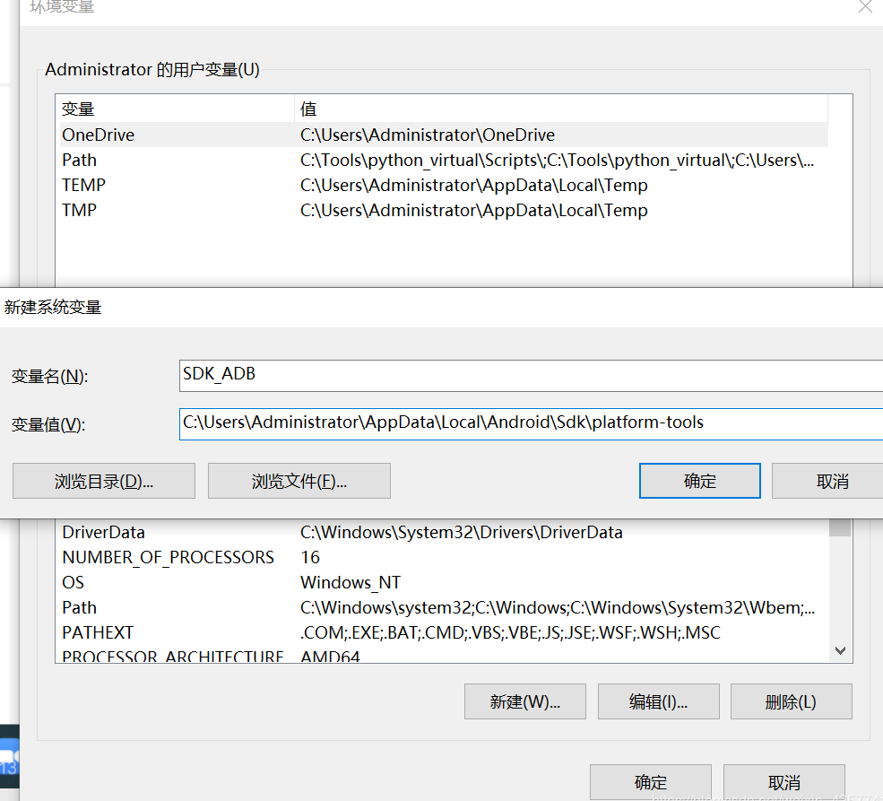
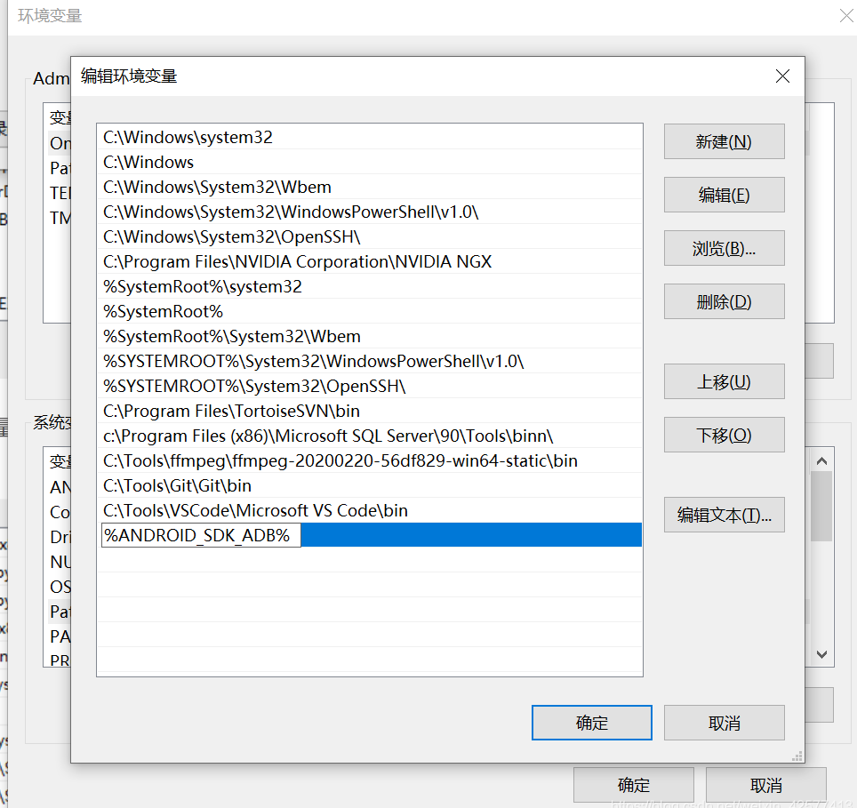
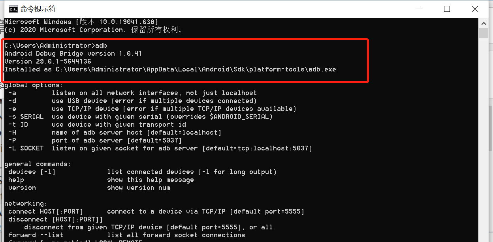
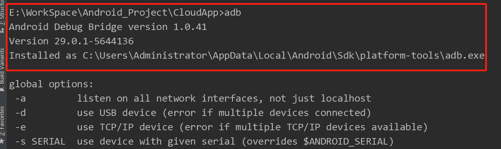

# chap0x08 第八章 Android 缺陷应⽤漏洞攻击实验
## 一、Android ADB命令
### ADB 全称为AndroidDebugBridge(android 调试桥)。在Android开发中,adb命令能很好的帮助开发者处理一些问题，adb具有安装卸载apk、拷贝推送文件、查看设备硬件信息、查看应用程序占用资源、在设备执行shell命令等功能。
### 常用的adb命令：
```
adb start-server// 启动adb server
adb kill-server//停止server
adb devices //显示的连接的设备列表
adb install apk的绝对路径 //安装apk
adb uninstall apk包名 //卸载apk
```
## 二、Android Studio配置ADB环境变量
### 1.打开Android studio找到sdk安装路径

### 2. 进入sdk安装目录的platform-tools文件夹下，并复制此路径

### 3. 新建系统变量
#### 搜索环境变量，并打开编辑

### 4. 找到path，新建

### 5. 验证是否成功配置



